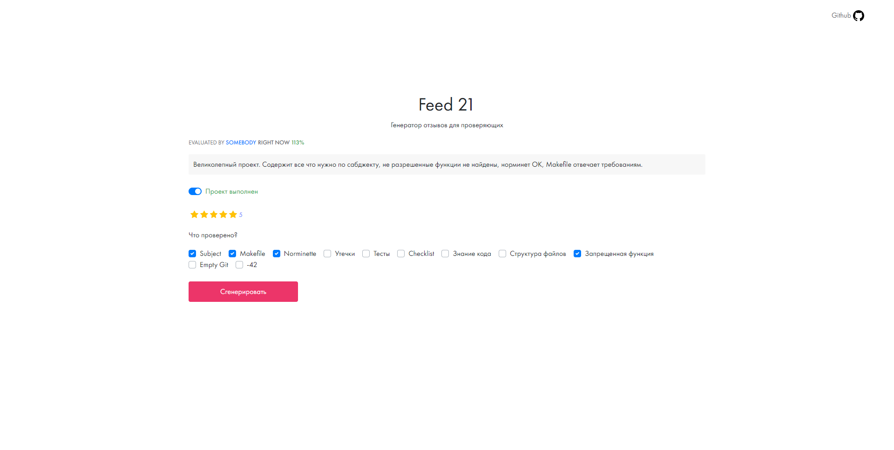

## Feed21

### About

This project is written as a tool for students of 21 school, it helps generate feedback for the person who reviewing the project.

The project was made using Vue 2 & Bootstrap Vue



### Usage

* Mark whether the project is completed.
* If it's completed, you need to give a grade from 1 to 5.
* Next, you should indicate which points were checked (if the project is completed), or in which there was an error (if the project is not completed).
* Click the "Generate" button to get the generated text.

All functions are created in accordance with [ESLint](https://eslint.org/) - the bunch of rules how code should be formatted.

### Requirements
Project requires:
* Node Package Manager 6.x or above

Tested on:
* Windows 10
* Linux Ubuntu 20.04

### Project setup
```
npm install
```

#### Compiles and hot-reloads for development
```
npm run serve
```

#### Compiles and minifies for production
```
npm run build
```

#### Lints and fixes files
```
npm run lint
```

#### Customize configuration
See [Configuration Reference](https://cli.vuejs.org/config/).